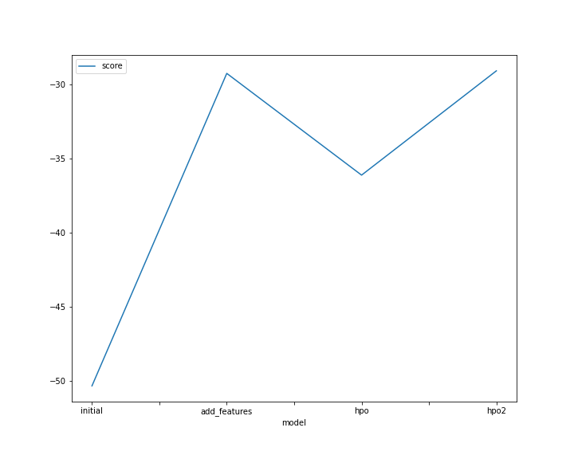

# Report: Predict Bike Sharing Demand with AutoGluon Solution
#### Michael Fronda 

## Initial Training
### What did you realize when you tried to submit your predictions? What changes were needed to the output of the predictor to submit your results?
When submitting the predictions of the dataset, there were negative values for the RMSE score. In turn, we needed to change those values to something more meaningful in terms of the regression (Bike Demand cannot be negative), so those values were adjusted to zeroes. Minorly, we also adjusted season from a numeric value to a categorical variable to better reflect what it represents 

### What was the top ranked model that performed?
WeightedEnsemble_L3 

## Exploratory data analysis and feature creation
### What did the exploratory analysis find and how did you add additional features?
EDA is a tool to explore training datasets to find potential combinations for either feature engineering or feature selection. For example the sum of casual and registered is the count so these derivatives were removed from training. One additional feature added was the breakdown of time into year, month, day, and hours. This would be useful as the additional information showcases the cycle of bike demand at certan times. For example, Bike demand was greater before working hours and after working hours (9am - 5pm) 

### How much better did your model preform after adding additional features and why do you think that is?
The selected model performed significantly better (1.77030 to 0.73771). This is because the additional features give the model an additional parameter to make predictions. The addition of hours and days for example gives better granularity into the date column. 

## Hyper parameter tuning
### How much better did your model preform after trying different hyper parameters?
My model did not gain too much more in terms of hyper parameter tuning. Probably because the hyperparameteres need to be optimized via a search 

### If you were given more time with this dataset, where do you think you would spend more time?
I would say more EDA is necessary to understand features, I think also understanding some of the models in Autogluon are needed as well to evaluate better hyper paramaters 

### Create a table with the models you ran, the hyperparameters modified, and the kaggle score.
|model|time|num_bag_folds|num_bag_sets|num_stack_levels|score|
|--|--|--|--|--|--|
|initial|600|0|0|0|1.77030|
|add_features|600|0|0|0|0.73771|
|hpo|600|1|6|1|0.72622|
|hpo2|900|10|20|3|0.73204|
|hpo3|900|20|20|3|0.72299|

### Create a line plot showing the top model score for the three (or more) training runs during the project.

### Create a line plot showing the top kaggle score for the three (or more) prediction submissions during the project.

## Summary
Overall, Autogluon is a powerful tool for selecting best performing models in an automated way. The most improvement came from using Feature Engineering and thus shows how powerful EDA can be. Hyper parameter tuning can be powerful and make additional gains but only if the base understanding of various models are chosen in the most optimal way. 
